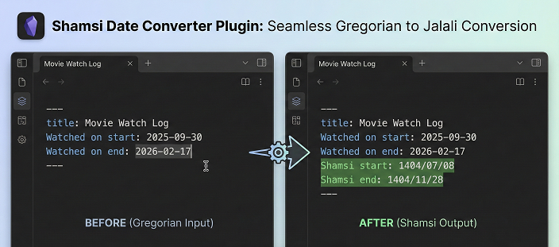

# Shamsi Date Converter Plugin for Obsidian

Automatically convert Gregorian dates to Shamsi (Jalali/Persian) dates in your Obsidian notes. Perfect for tracking movie watch dates, reading logs, or any time-based records with both start and end dates!



## Features

- **✨ Multiple Date Pairs**: Support for start/end dates or any custom date property pairs
- **🔄 Automatic Conversion**: Automatically adds Shamsi dates when you add Gregorian date properties
- **♻️ Automatic Updates**: When you change source dates, Shamsi dates update automatically
- **⚙️ Customizable Mappings**: Add, edit, or remove date pair mappings in settings
- **⚡ High Performance**: Optimized with early returns - only processes files with relevant properties
- **🎯 Manual Conversion**: Command palette option to convert current file
- **📅 Flexible Date Formats**: Support for various Gregorian date formats
- **🎨 Configurable Output**: Choose your preferred Shamsi date format

## Installation

### Manual Installation

1. Download the plugin files (`main.js` and `manifest.json`)
2. Create a folder named `shamsi-date-converter` in your vault's `.obsidian/plugins/` directory
3. Copy the downloaded files into this folder
4. Restart Obsidian or reload plugins
5. Enable "Shamsi Date Converter" in Settings → Community plugins

### From Community Plugins (when published)

1. Open Settings → Community plugins
2. Search for "Shamsi Date Converter"
3. Click Install, then Enable

## Usage

### Multiple Date Pairs Example

The plugin handles multiple date pairs simultaneously:

```yaml
Watched on start: 2025-09-30
Watched on end: 2026-02-17
```

After saving, it automatically adds both Shamsi dates:

```yaml
Watched on start: 2025-09-30
Watched on end: 2026-02-17
Shamsi start: 1404/07/08
Shamsi end: 1404/11/28
```

### Automatic Updates

Change any source date and the corresponding Shamsi date updates automatically:

```yaml
Watched on start: 2025-10-15  ← Changed from 2025-09-30
Watched on end: 2026-02-17
Shamsi start: 1404/07/23  ← Automatically updated!
Shamsi end: 1404/11/28
```

### Manual Conversion

1. Open a note with date properties
2. Open Command Palette (Ctrl/Cmd + P)
3. Search for "Convert all date pairs to Shamsi"
4. Execute the command

## Settings

Access settings via Settings → Shamsi Date Converter:

### Basic Settings
- **Auto-convert**: Enable/disable automatic conversion on file modification
- **Date format**: Output format for Shamsi dates (YYYY/MM/DD, YYYY-MM-DD, etc.)

### Date Pair Mappings

Configure which properties should be converted:

**Default Pairs:**
1. `Watched on start` → `Shamsi start`
2. `Watched on end` → `Shamsi end`

**Custom Pairs:**
- Click "Add Date Pair" to create new mappings
- Click "Edit" to modify existing pairs
- Click "Delete" to remove pairs you don't need

### Example Custom Mappings

**For Reading Tracker:**
```
Source: "Started reading"  → Target: "تاریخ شروع"
Source: "Finished reading" → Target: "تاریخ پایان"
```

**For Projects:**
```
Source: "Project start"    → Target: "Shamsi project start"
Source: "Project deadline" → Target: "Shamsi deadline"
```

**For Events:**
```
Source: "Event date"       → Target: "تاریخ رویداد"
```

## Supported Date Formats

The plugin accepts various Gregorian date formats:
- `2024-02-12` (ISO 8601 - recommended for best performance)
- `2024/02/12`
- `Feb 12, 2024`
- `February 12, 2024`
- Any format parseable by JavaScript Date object

## Examples

### Example 1: Movie Watching Tracker

```yaml
---
title: Inception
type: Movie
Watched on start: 2024-01-15
Watched on end: 2024-01-15
Shamsi start: 1402/10/25
Shamsi end: 1402/10/25
rating: 5
---
```

### Example 2: TV Series Tracker

```yaml
---
title: Breaking Bad
type: TV Series
Watched on start: 2024-06-01
Watched on end: 2024-08-15
Shamsi start: 1403/03/12
Shamsi end: 1403/05/25
seasons: 5
---
```

### Example 3: Book Reading Log

```yaml
---
title: The Alchemist
Started reading: 2024-03-01
Finished reading: 2024-03-20
Shamsi reading start: 1403/01/11
Shamsi reading end: 1403/01/30
---
```

### Example 4: Persian Date Usage

```yaml
---
title: نوروز
Event date: 2024-03-20
تاریخ شمسی: 1403/01/01
---
```

## How It Works

1. **File Modification Detection**: Monitors when you save or modify files
2. **Quick Check**: Scans if file contains any configured source properties
3. **Property Extraction**: Parses frontmatter and extracts Gregorian dates
4. **Conversion**: Converts dates using Persian calendar algorithm
5. **Smart Update**: Only writes to file if Shamsi dates are missing or outdated

## Troubleshooting

### Dates not converting?

- ✓ Check that auto-convert is enabled in settings
- ✓ Verify property names match your settings exactly
- ✓ Ensure dates are in valid format (try YYYY-MM-DD)
- ✓ Try the manual conversion command
- ✓ Check console (Ctrl/Cmd + Shift + I) for errors

### Plugin not loading?

- ✓ Files must be in `.obsidian/plugins/shamsi-date-converter/`
- ✓ Restart Obsidian completely
- ✓ Check Developer Console for error messages

## Advanced Usage

### Empty/Missing Dates

If a source property exists but has no value:
```yaml
Watched on start: 
```

The plugin will skip it (no Shamsi date added until you fill in the source).

### Mixed Date Pairs

You can have files with different combinations:
- Some with only start dates
- Some with both start and end
- Some with neither

The plugin handles all cases gracefully!

## Development

Want to contribute or customize?

1. Clone the repository
2. Modify `main.js`
3. Test in your vault's plugin folder
4. Submit pull requests!

## License

MIT License - feel free to use and modify as needed.

## Support

If you encounter issues:
1. Check the troubleshooting section
2. Check Developer Console for specific errors
3. File an issue with example files and error messages

## Credits

- Shamsi calendar conversion algorithm based on standard Persian calendar calculations
- Built with ❤️ for the Obsidian community
- Special thanks to all users providing feedback and feature requests!

## Support
This project is offered for free so everyone can use it without restrictions.
If you found this tool useful, you can support its continuous development and improvement through donations.

<a href="https://www.coffeete.ir/milads55">
  
</a>
<br><br>
<a href="https://buymeabitcoffee.vercel.app/btc/bc1qwxju09p2wywqqq8udj2am8csvn6r4p4z6720q3">
  
</a>

---

**Enjoy seamless Gregorian ↔ Shamsi date conversion!** 🎉📅
